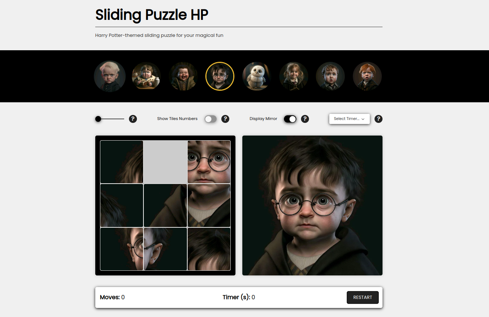

This is a [Next.js](https://nextjs.org/) project bootstrapped with [`create-next-app`](https://github.com/vercel/next.js/tree/canary/packages/create-next-app).

## Purpose

This project has been created with the goal to practice the following technologies:

- [Radix UI](https://www.radix-ui.com/primitives) - set of primitive building blocks to design a project UI.
- [Panda](https://panda-css.com/) - CSS Library that provides styling solution for modern web browsers.

### Tutorial

Inside the [tutorial directory](./docs/tutorial/Overview.md), you will find the list of activities to install Radix components, setup Panda, and combine both. Besides, there will some activites to configure linter and prettier tools to force standardization accross the project. At last, we will guide you to deploy the application through Vercel.

### Challenge

After the tutorial has been completed, feel free to add any Radix components and style the whole app with Panda, as a way to better consolidate the knowledge. An example of the game has been provided on production ([Harry Potter themed sliding puzzle](https://sliding-puzzle-hp.vercel.app/)):



The game functionality is already provided for you, you just have to use it in the Radix components you add. For the challenge, it's expected you:

- Add at least 8 different Radix.
- Customize Panda theme and apply it to all your Radix components.
- Get rid of all styles from inside the `global.css` file.

You can order the sections and components, as you wish. Also, define your own design, the way you prefer. It's not expected that you develop backend logic but feel free to do so in case that will be necessary for your UI components you decided to place in the page.

As last note, make it sure you are using free licensed images from repositories like [Pexels](https://www.pexels.com/).

## Setup

In order to run the tutorials, you will have initially to setup the project locally. Make it sure you have run:

```bash
npm run setup
```

That 'setup' command will clean all built (auto-generated) directories and files, besides cleaning npm cache, which is necessary sometimes since Panda might be getting cached by NextJs. Therefore, stop the server and run the setup whenever is needed.

## Run

To run the development server:

```bash
npm run dev
```

Open [http://localhost:3000](http://localhost:3000) with your browser to see the result.

## Learn More

To learn more about Next.js, take a look at the following resources:

- [Next.js Documentation](https://nextjs.org/docs) - learn about Next.js features and API.
- [Learn Next.js](https://nextjs.org/learn) - an interactive Next.js tutorial.

You can check out [the Next.js GitHub repository](https://github.com/vercel/next.js/) - your feedback and contributions are welcome!

## Deploy on Vercel

The easiest way to deploy your Next.js app is to use the [Vercel Platform](https://vercel.com/new?utm_medium=default-template&filter=next.js&utm_source=create-next-app&utm_campaign=create-next-app-readme) from the creators of Next.js.
