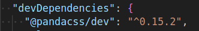
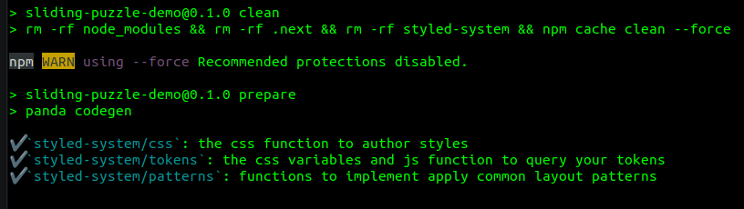
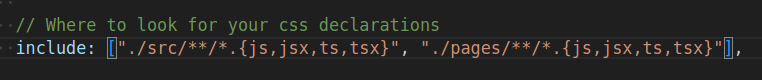
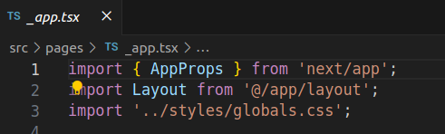
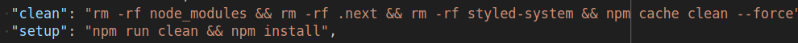
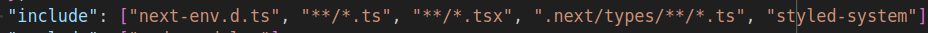
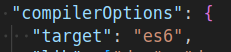
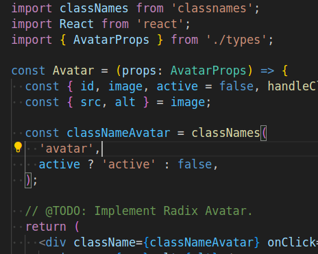
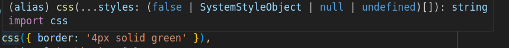

## Setup Panda

To setup Panda, since this is a NextJS project, follow [this page](https://panda-css.com/docs/installation/nextjs) from Panda official documentation (skip step 1 since the NextJS already project already exists):

```bash
npm install -D @pandacss/dev
npx panda init --postcss
```

The first command can take a while to complete. It will add the package as a dev dependency (check [package.json](../../../package.json) file):



The second command will install Panda as a [PostCSS](https://panda-css.com/docs/installation/postcss) plugin. Alternatively, Panda can be used through [Panda CLI](https://panda-css.com/docs/installation/cli), but, to summarize, PostCSS can be leveraged to process (optimize, transform, and extend) Panda's CSS code. By default, when integrating PostCSS by running the `npx` command above, it will generate the following files/directory at the project root:

- `panda.config.ts` - similar to tailwind config file, this file allows to customize Panda's default theme.
- `postcss.config.cjs` - PostCSS configuration file. This will automatically disable [NextJS default behavior](https://nextjs.org/docs/pages/building-your-application/configuring/post-css#default-behavior) and allows us to interfere in the CSS compilation process. For this project, we will not change this file, but feel free to try options like changing autoprefixer rules.
- `styled-system/` - this is the Panda style engine that allows CSS-in-JS development. It contains all primitive functions we can use to inject CSS into the React components that, by taking advantage of static analysis scanning, will generate styles on demand.

A few minor steps will be required to complete the setup. First, ensure the panda output directory (`./styled-system`) is regenerated after each dependency installation. For that, we just have to add the following script in `./package.json` file:

```json
"prepare": "panda codegen"
```

Automatically, after install command has been executed, the Panda package will run `npm run prepare`. Do a quick test to make it sure this step is executed:

```bash
npm run setup # setup script runs 'npm run clean' and 'npm run install'
```

You should see this as part of the log output:



Now, open the `panda.config.ts` file and make it sure Panda is targeting the project files we will inject CSS-in-JS. By default, it will be:



Since we included all sources, including `pages`, inside the `./src` directory, this config can be simplified to:

```json
include: ['./src/**/*.{js,jsx,ts,tsx}'],
```

However, understand that in case you add other source code that relies on Panda functions in other directory, out of `./src`, you have to map it in the inclusions, otherwise the styles will not be applied.

At last, we have to set the needed layers to our CSS entry (in this case, `.src/styles/globals.css`). Add the following to the top of the file:

```css
@layer reset, base, tokens, recipes, utilities;
```

For new NextJS projects, in case the CSS entry did not exist before, you will have to strategically import it in a global place to affect all pages in the application. The Panda documentation suggests to be imported in the app `layout.tsx` file, but here we already import it in the `./src/pages/_app.tsx` which works just fine:



### Final Considerations

At this point, we should be good to start using Panda. Still, a few last items to be considered:

- Panda documentation mentions "sometimes Next.js caches PostCSS generated styles and when that happens you need to clear the cache. To do that, delete the `.next` folder and restart your development server". They suggest to add `rm -rf .next` as part of the `dev` script. Here, instead we added as part of the clean task that runs once we run `npm run setup`:

  

  This has been chosen to make it sure we don't have issues when building the application on production, specially when deploying on Vercel. So, in case of caching issues, you should stop the application and run the setup, OR you can also modify the dev script as suggested by the Panda documentation.
- The Panda documentation mentions additional configuration in the `./tsconfig.json` file in case the autocomplete IDE is not working. For this project, it seems to work fine for VSCode, but if you still have issues with autocomplete, try adding `styled-system` to the tsconfig inclusions:

  
- The Panda documentation mentions there might be issues in transpiling the code to ES5, so in new projects you might have to force the target version of Javascript in the `./tsconfig` file to be higher, but right now this project is using ES6, which should already prevent this issue from happening:

  
- Since the `./styled-system` directory is auto-generated, this can be ignored from versioning. Add the following to the `.gitignore` file:

  ```
  # panda
  /styled-system/*
  ```


## Usage

In order to test if the setup worked properly, do a quick change to an existing component. For instance, Avatar (`./src/components/Avatar/Avatar.tsx`):



In this component, the `classNameAvatar` const is injected into the main div. For the test, we can use the `css()` function to set a green border:

```typescript
const classNameAvatar = classNames(
  'avatar',
  // This is the new line containing Panda CSS-in-JS function
  css({ border: '4px solid green' }),
  active ? 'active' : false,
);
```

Make it sure you import the proper function from the Panda engine (`./styled-system/``):

```typescript
import { css } from '../../../styled-system/css';
```

Notice the return of the Panda `css()` function is a `string` so it can be perfectly used along `classNames` to compose styles (worth to mention that Panda offers what they call ["recipes"](https://panda-css.com/docs/concepts/recipes) that kind of allows us do the same):



After saving the file, you will notice a change in the dev application (in case the change is not applied, review the setup steps once again and in last case restart the server and/or re-run setup task):


You can follow Panda documentation to start [writing styles](https://panda-css.com/docs/concepts/writing-styles) as you wish.
