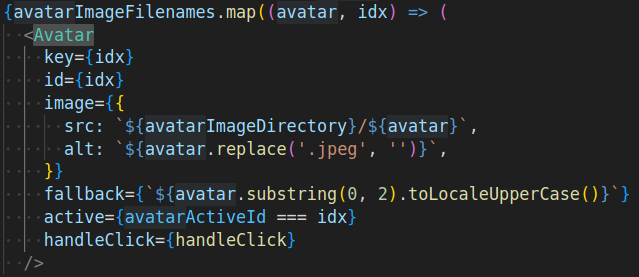
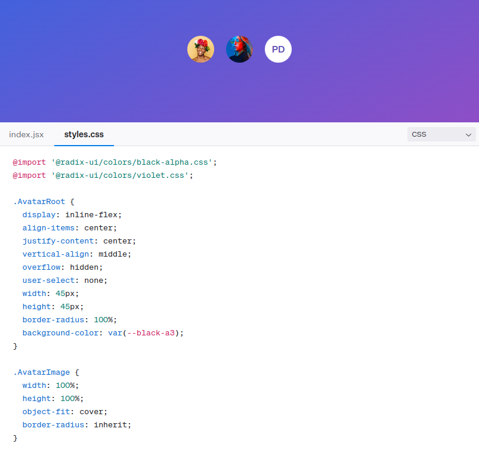
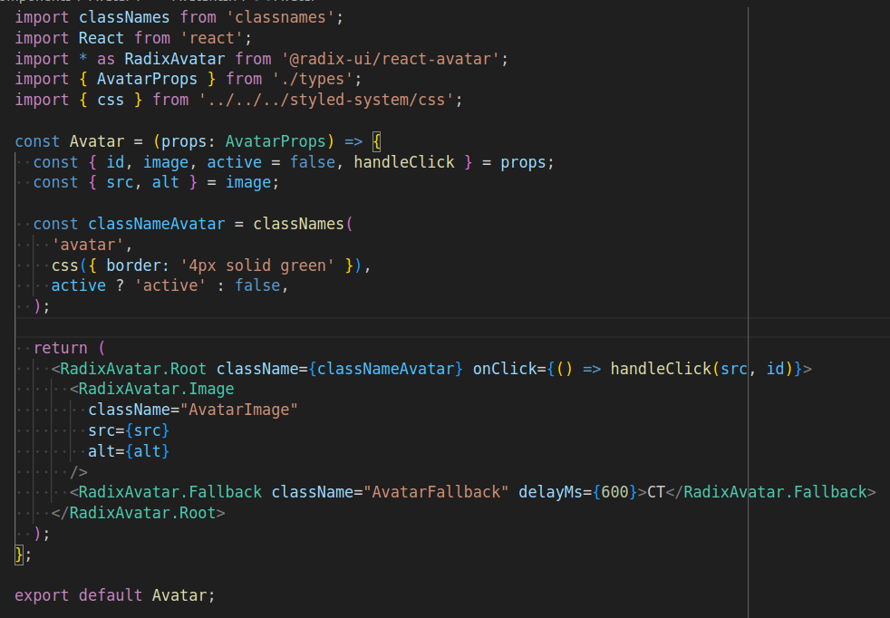
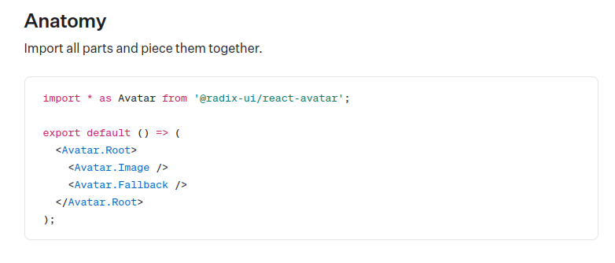

## Setup Radix Avatar

Radix UI provide several separate packages to be used individually in the project. These packages are primitives that can be composed to build more complex features. One big advantage of this approach is that we don't have to add a large UI dependency just to use one component or another, unnecessarily harming the application performance. For this exercise, we will replace the current `./src/components/Avatar/Avatar.tsx` with the equivalent [Radix Avatar component](https://www.radix-ui.com/primitives/docs/components/avatar).

To install the Avatar package:

```bash
npm install @radix-ui/react-avatar
```

## Usage

From their documentation for the Avatar component, Radix provide the following code to be added:

```typescript

import React from 'react';
import * as Avatar from '@radix-ui/react-avatar';
import './styles.css';

const AvatarDemo = () => (
  <div style={{ display: 'flex', gap: 20 }}>
    <Avatar.Root className="AvatarRoot">
      <Avatar.Image
        className="AvatarImage"
        src="https://images.unsplash.com/photo-1492633423870-43d1cd2775eb?&w=128&h=128&dpr=2&q=80"
        alt="Colm Tuite"
      />
      <Avatar.Fallback className="AvatarFallback" delayMs={600}>
        CT
      </Avatar.Fallback>
    </Avatar.Root>
    <Avatar.Root className="AvatarRoot">
      <Avatar.Image
        className="AvatarImage"
        src="https://images.unsplash.com/photo-1511485977113-f34c92461ad9?ixlib=rb-1.2.1&w=128&h=128&dpr=2&q=80"
        alt="Pedro Duarte"
      />
      <Avatar.Fallback className="AvatarFallback" delayMs={600}>
        JD
      </Avatar.Fallback>
    </Avatar.Root>
    <Avatar.Root className="AvatarRoot">
      <Avatar.Fallback className="AvatarFallback">PD</Avatar.Fallback>
    </Avatar.Root>
  </div>
);

export default AvatarDemo;

```

We will **not** need all of this. Starting with the imports, we are not going to use that specific CSS entry (`./styles.css`). Also, since we already defined our exported component as "Avatar", we can't use the same alias when importing Radix Avatar dependency. Instead, we can do this:

```typescript
import React from 'react';
import * as RadixAvatar from '@radix-ui/react-avatar';
```

Taking a closer look to their example, they are displaying the avatars in their demo component. In our game, we already have the logic in the `./src/pages/index.tsx` to display all avatars based on a list:



That means we are handling our Avatar component, equivalent to thei AvatarDemo, as a single component to be rendered, so we only need one of the examples to be placed in the return. Just remember we changed the alias, so we have to modify to this:

```typescript

<RadixAvatar.Root className="AvatarRoot">
  <RadixAvatar.Image
    className="AvatarImage"
    src="https://images.unsplash.com/photo-1492633423870-43d1cd2775eb?&w=128&h=128&dpr=2&q=80"
    alt="Colm Tuite"
  />
  <RadixAvatar.Fallback className="AvatarFallback" delayMs={600}>CT</RadixAvatar.Fallback>
</RadixAvatar.Root>

``` 

After this change, the site will be displaying:


At this moment, you should have noticed we lost all styles in this component. Besides, we are hardcoding the content since we got the example directly from Radix, and the clicks on the Avatars are not reflecting the images in the game board.

Starting with the click, we already provided a handler that is propagated to the component, so we just need to make it sure we are adding it again to the `<RadixAvatar.Root>` element. For the images, it's pretty much the same, the `src` and `alt` properties are also available, we just have to update it in the `<RadixAvatar.Image>` element, so it becomes:  

```typescript
  return (
    <RadixAvatar.Root className="AvatarRoot" onClick={() => handleClick(src, id)}>
      <RadixAvatar.Image
        className="AvatarImage"
        src={src}
        alt={alt}
      />
      <RadixAvatar.Fallback className="AvatarFallback" delayMs={600}>CT</RadixAvatar.Fallback>
    </RadixAvatar.Root>
  );
```

Now, after resaving the file, we will have again the avatars expected images, and functionality:


For the styles, Radix does not provide them by default. From their understanding and vision, this is leads to inacessible, non-performant, and lacking of important features, since developers are forced to override tons of styles. Instead, they prefer to give us full control of the look & feel. That said, they still provide initial styles for us to see the component as they show in their demos. For each component, there will be a "styles.css" tab we can use it as basis for styling the component:



When adding new Radix components, that is really helpful as a starter point but right now, in this project, we already a set of styles to be reused. The difference is the name of the classes, we are using `.avatar` instead of `.AvatarRoot`:


Therefore, we might expect to see the previous look & feel by just replacing the root class. Since we are adding it as part of the const `classNameAvatar` in the Avatar component file, we just have to use it. In the end, this will be the final code:



And this will produce the following result:


### Final Considerations

You must have noticed from their example, there is a last element named "Fallback". This is used in case the image can not be displayed. For this exercise we didn't change it but the fallback is important so feel free to style it. In order to make the component generic enough to receive the value, we have to modify the props in the component types file.

For better understanding of the component anatomy, check the anatomy section and also sections right after to understand the attributes of each element:



