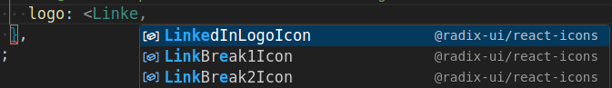
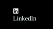

## Radix Icons

Radix already provide built-in components for icons. The list is huge and can be found [here](https://www.radix-ui.com/icons). In order to use those, you just to install the icons dependency:

```bash
npm install @radix-ui/react-icons
```

In the documentation page, you can hover the icon to see its name so you can import. Example, if I want to use the LinkedIn logo:  


The name of the component will be `LinkedInLogoIcon` then, in this case. Let's add this logo into the Footer component (`./src/components/Footer/Footer.tsx`), there will be a `<div />` placeholder for the logo we want to set:

```typescript
  const socialMedias = [
    {
      label: 'LinkedIn',
      url: 'https://...',
      // @TODO: Replace with Radix/custom Logos.
      logo: <div />,
    },
  ];
```

After you start typing `<LinkedInL...`, you will probably see the autocomplete suggesting the component from the Radix icons package you have just installed:  



After adding it and saving the component, you will see it rendered on the footer:



Now it is just a matter to style it with Panda.