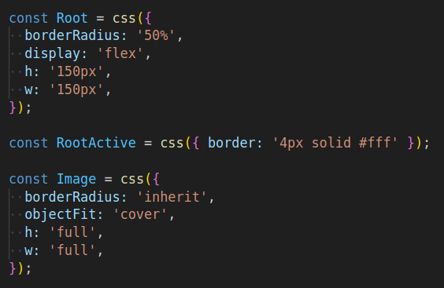
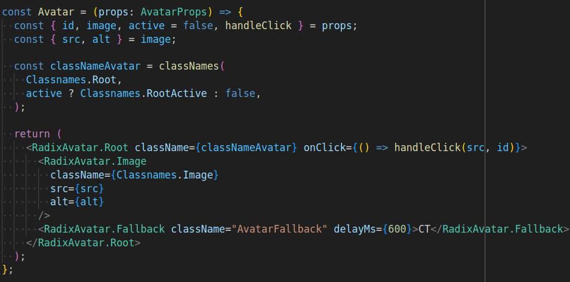

## Combine Panda to Radix Avatar

Now it's time to get rid of some the files in the `./src/styles/globals.css` file and make it by CSS-in-JS functions. In the previous exercise, we added Radix Avatar and set the "avatar" class to the root div, which is styled by the following CSS block:

```css
.avatar {
  border-radius: 50%;
  display: flex;
  height: 150px;
  width: 150px;
}

.avatar.active {
  border: 4px solid #fff;
}

.avatar img {
  border-radius: inherit;
  object-fit: cover;
  height: 100%;
  width: 100%;
}
```

First, let's create three constants to save the string returned from the Panda `css()` functions that will generate the styles, like:  


```typescript
const Root = css({

});

const RootActive = css({

});

const Image = css({

});
```

Next step, we have to convert each of the styles to the expected Panda's `css()` function object parameter, following this property/value nomenclature: use camel case for CSS properties separated by hyphen (e.g. `border-radius` becomes `borderRadius`); some CSS properties have shorthand, like `width` that can be written as `w`; most of the CSS values will be strings, except a few ones that will accept numbers. In the end, it will look like this:



Optionally, you can create an object to centralize these styles, like:

```typescript
const Classnames = {
  Image,
  Root,
  RootActive,
};
```

At last, we have to update the classes in each element. However, notice in this particular case, we are combining classes in `classNameAvatar` because we depend on React state for the `active` flag in order to determine the active style, so we have to replace "avatar", which is the root, with "Classnames.Root" and "active" with "Classnames.RootActive". For the image, replacing "AvatarImage" with `{Classnames.Image}` should be enough:



After removing the CSS block related to ".avatar", ".avatar.active", and ".avatar img" from the global CSS file, you might see this result:


### Final Considerations

For a closer result to the [Harry Potter themed sliding puzzle](https://sliding-puzzle-hp.vercel.app/), the root should be:

```typescript
const Root = classNames(
  flex({align: 'center', justify: 'center' }),
  css({
    borderRadius: '50%',
    overflow: 'hidden',
    userSelect: 'none',
    w: 'full',
    h: 'full',
    cursor: 'pointer',
    transition: 'transform .2s ease-in-out',
    lg: {
      w: '150px',
      h: '150px',
      _hover: { transform: 'scale(1.1)' },
    },
  }),
);
```

Notice we have another function, named `flex()`, that applies flexbox sets of styles (See [Panda patterns doc](https://panda-css.com/docs/concepts/patterns#flex)), which makes easier to address CSS `align-items` and `justify-content` properties due to its shorthand, not available in the `css()` function. Also, since `flex()` returns a `string`, this can be combined with `css()` styles by using `classNames`.

Other aspect of the last code is the use of [responsive design](https://panda-css.com/docs/concepts/responsive-design), by injecting an inner object of properties in a device (`lg`, in this case) property. Since Panda uses mobile first approach, all styles set to `lg` will be applied to medias above 1024px by default.

Also, there is a [conditional style](https://panda-css.com/docs/concepts/conditional-styles) for a hover effect. There other conditionals you can find in the Panda documentation but we want to highlight it here that hover effect is not good for mobile, so that makes sense to have it only on desktop devices.

In the end, these will not make very remarkable changes to the rendered component, but those styles help to create a better UX.

At last, for a `Fallback` example, here is:

```typescript
const Fallback = classNames(
  flex({ align: 'center', justify: 'center' }),
  css({
    bg: '#000',
    color: '#fff',
    w: 'full',
    h: 'full',
    fontSize: '28px',
    lineHeight: 1,
    fontWeight: 700,
  }),
);
```