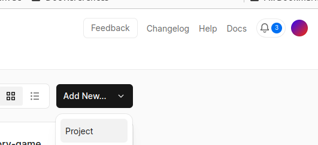
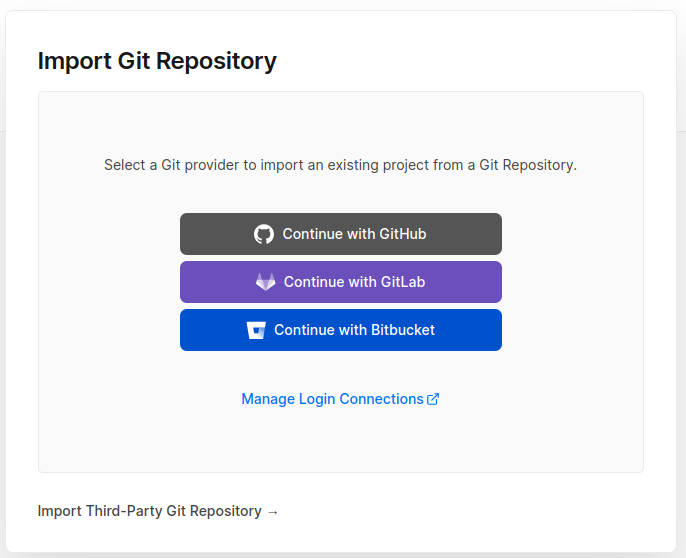
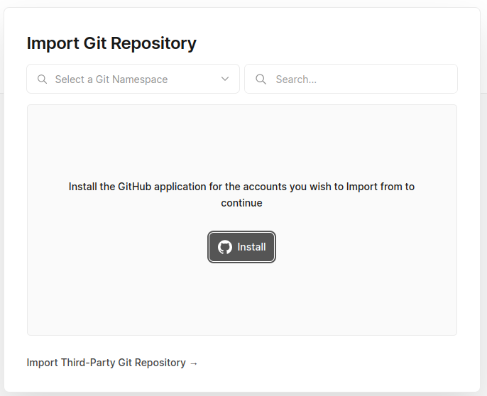
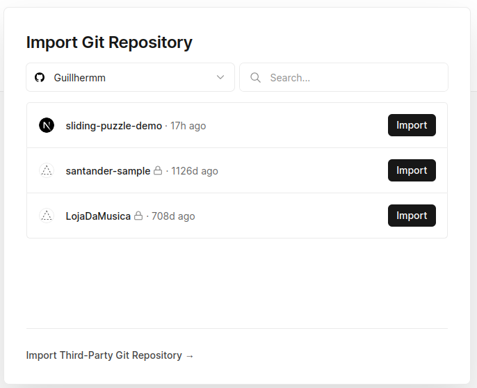
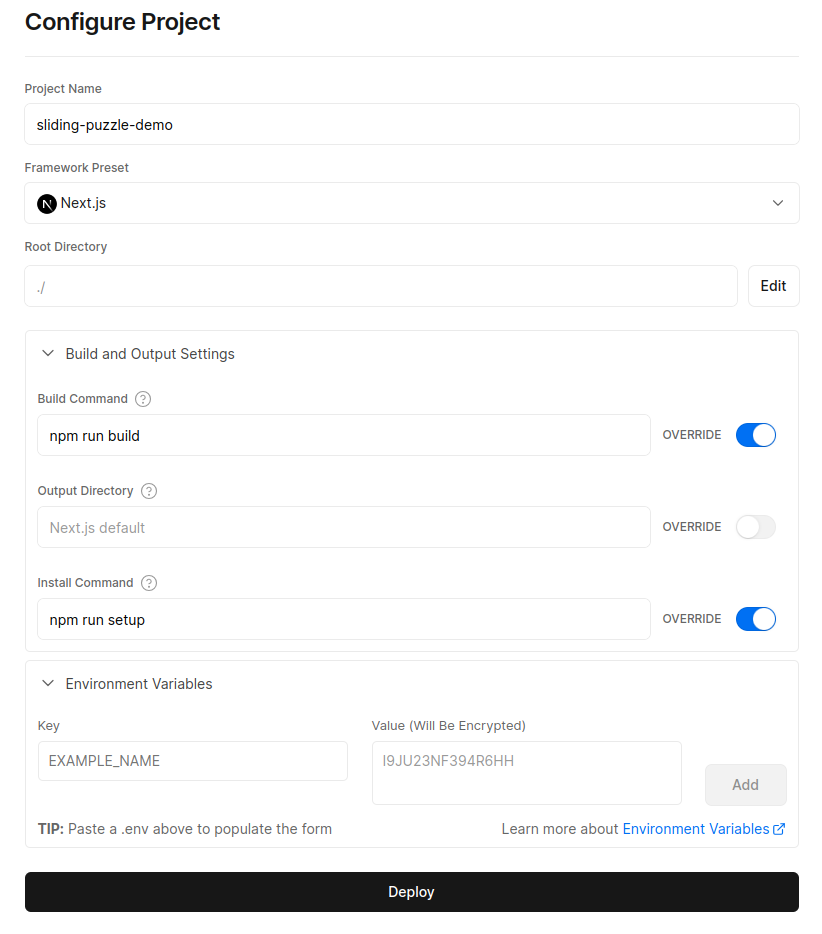
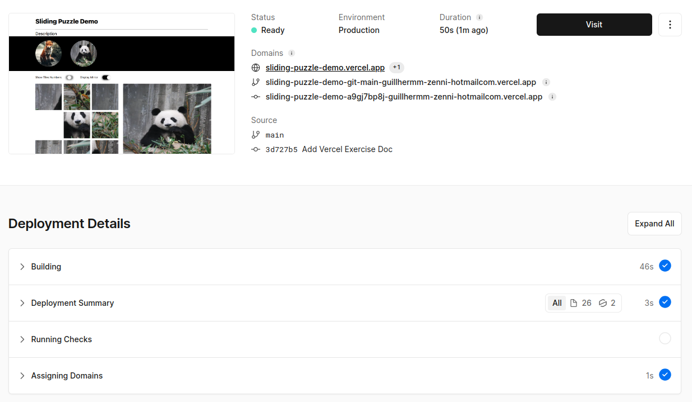
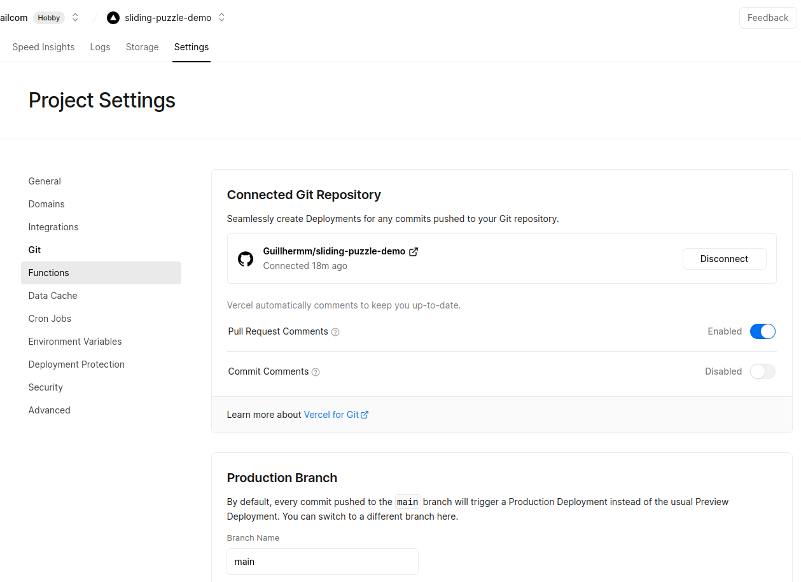

## Vercel Deployment

Before we deploy on Vercel, make it sure you have run `npm run setup && npm run build` locally to the latest code pushed to the origin.

As already described in the ReadMe file, Vercel is an easy way to deploy NextJS applications. After you have created a free account, you have to start a new project:

If that's the first time you create a project in Vercel, there will be a Git Provider to be chosen in order to connect Vercel to the application source code. If you have already connected a provider before and the provider is not the one you want to target for the new app, you just have to look for the "switch provider" option, which will lead to this screen:

For this particular case, select GitHub provider. A new popup will appear for you authorize. It might be the case you have to "install" the GitHub application for Vercel:

After properly installing/authorizing all repositories, a list of those available will be displayed:

All you have to do is "Import" the repo you want for the new project, but clicking on the respective dark button. This will lead to another screen where you will define the base settings for the first deploy:

- Project Name - the name of the project on Vercel. It's automatically populated by the repository name, but this can be changed.
- Framework Preset - the base technology of the project. If not set "Next.js" by default, select that option manually.
- Root Directory - the name is auto explicative, it's the root directory in the server. Keep the default "./".
- Fieldset "Build and Output Settings" - the commands to be executed during building/installation process. Depending on the project, this configs might be different, but for this project, you can switch on the override option for "Build Command" and add `npm run build`, and override the "Install Command" with `npm run setup`.
- Fieldset "Environment Variables" - env variables required by the application. The initial state of this puzzle demo does not contain any env variables but in case you add it later, do not forget to set those, otherwise the build will fail.

After configuring and hinting "Deploy", the process will start. If nothing is breaking the build, you will be redirect to the page containing the links for the application deployed on production:

If it didn't deploy properly, that means there is an error in your codebase or a misconfiguration in the Vercel project. Try doing the first step in this document, and making sure the build command is running properly in the versioned code. If that works, double-check the Vercel logs in order to understand the issue that resulted in an error in the deploy.

At last, anytime you go to your Vercel project, you can change your deployment settings. One last mention is that once you connected your Git Provider repository to your Vercel project, it will automatically create a webhook to trigger the deployment after changes have been detected to the main repository branch:

